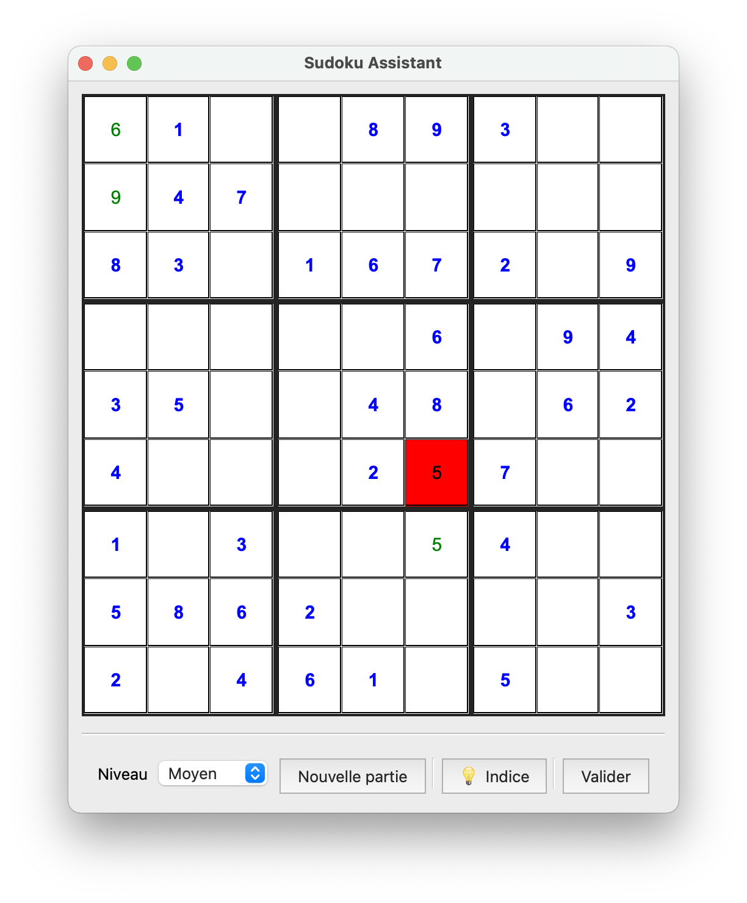

# Sudoku Assistant

This school project aims to create a Sudoku game with tips and validation provided by an artificial intelligency.

## Getting Started

These instructions will get you a copy of the project up and running on your local machine for development and testing purposes.  
See [deployment](#deployment) for notes on how to build and deploy the project on a live system.

## Prerequisites

This project was developed in C++ using Qt Framework v4 under Qt Creator. No plugins are required.
Get Qt [here](https://www.qt.io/download).

## Authors

 - **Maxime STEVENOT** - <stevenot@ecole.ensicaen.fr>
 - **Guillaume HANNES** - <hannes@ecole.ensicaen.fr>

## License

For Sudoku Assistant
Copyright Maxime Stevenot, Guillaume Hannes

This software is governed by the CeCILL license under French law and
abiding by the rules of distribution of free software.  You can  use, 
modify and/or redistribute the software under the terms of the CeCILL
license as circulated by CEA, CNRS and INRIA in [LICENSE.md](LICENSE.md) 
file or at the following URL "http://www.cecill.info". 

As a counterpart to the access to the source code and  rights to copy,
modify and redistribute granted by the license, users are provided only
with a limited warranty  and the software's author,  the holder of the
economic rights,  and the successive licensors  have only  limited
liability. 

In this respect, the user's attention is drawn to the risks associated
with loading,  using,  modifying and/or developing or reproducing the
software by the user in light of its specific status of free software,
that may mean  that it is complicated to manipulate,  and  that  also
therefore means  that it is reserved for developers  and  experienced
professionals having in-depth computer knowledge. Users are therefore
encouraged to load and test the software's suitability as regards their
requirements in conditions enabling the security of their systems and/or 
data to be ensured and,  more generally, to use and operate it in the 
same conditions as regards security. 

The fact that you are presently reading this means that you have had
knowledge of the CeCILL license and that you accept its terms.
